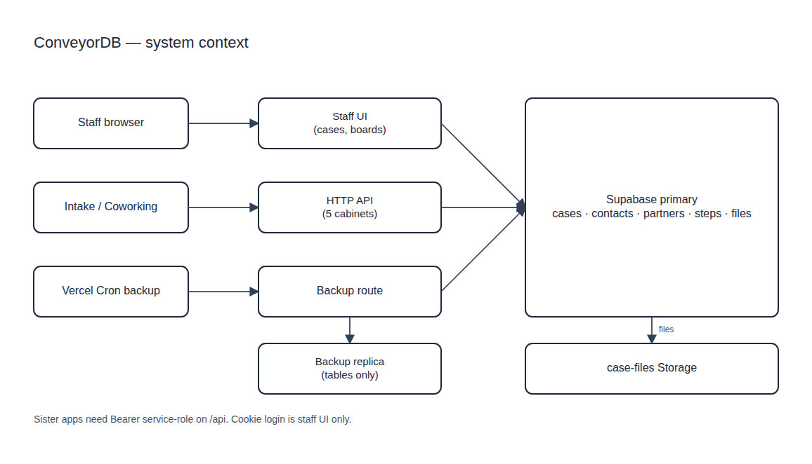
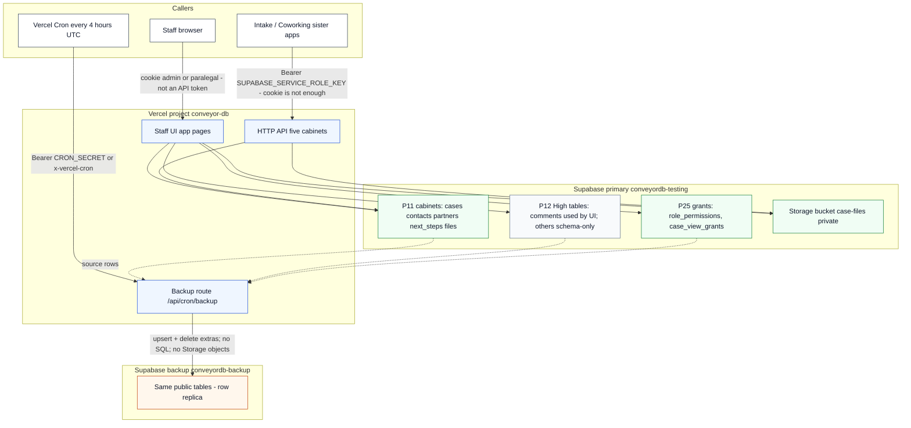
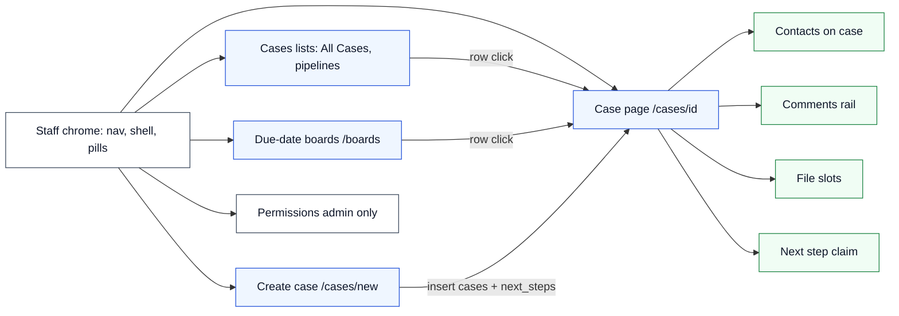
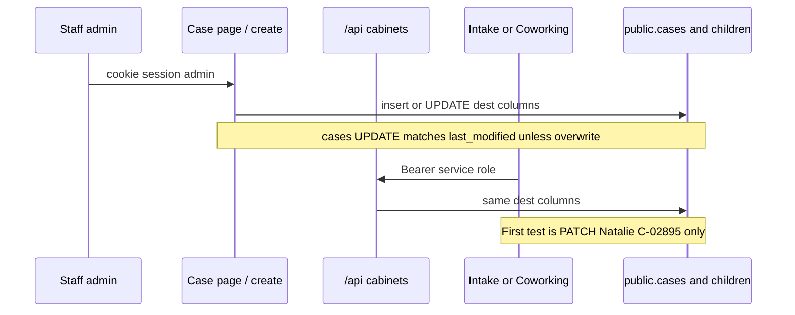
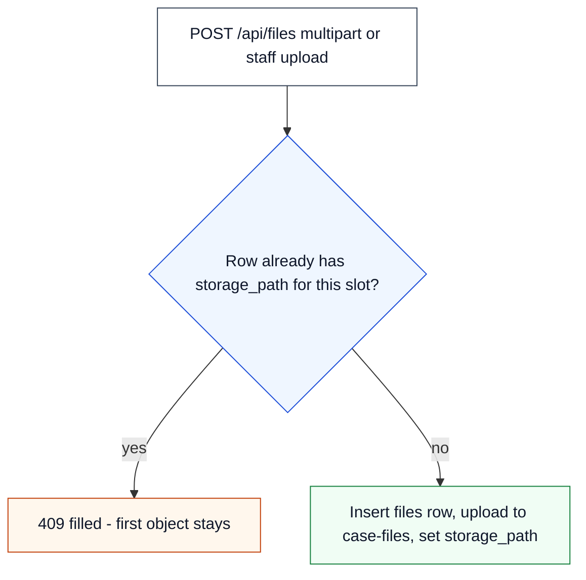

# Architecture

Boxes are **modules that exist in this repo**. Arrows are control or data flow as implemented today. This is not a target-state diagram.

White / light fills so the chart stays readable on GitHub’s default background.

## Excalidraw (system context)

Clean white-background export for non-engineers. Same highest-level flow as the Mermaid below: staff cookie vs sister-app Bearer, five cabinets on primary, files in `case-files`, backup replica of tables only.

- PNG: [`diagrams/conveyordb-system-context.png`](diagrams/conveyordb-system-context.png)
- Editable scene (Excalidraw v2, roughness 0): [`diagrams/conveyordb-system-context.excalidraw`](diagrams/conveyordb-system-context.excalidraw)

## System context (Mermaid)

## Staff UI modules

## Write paths (who may change a row)

## File slot rule

A filled slot (`same case_id` + `slot_name` and a non-empty `storage_path`) is **409**. The first `case-files` object is not replaced or deleted. There is **no** unique index on `(case_id, slot_name)` — do not add one.

## What is not in this picture

These are easy to assume and **are not** modules here:

- No Intake form, Google/Dropbox pickers, or `intake_submissions` tables.
- No Airtable dual-write from the Next.js app. Copy scripts are dry-run only.
- No dedicated staff pages for the Contact, Partner, Next Step, or File cabinets.
- No live collaboration. Conflicts are optimistic (`last_modified` / `updated_at`).
- Backup does not copy Storage objects and does not apply SQL.

See [README.md](README.md) for the module index.
